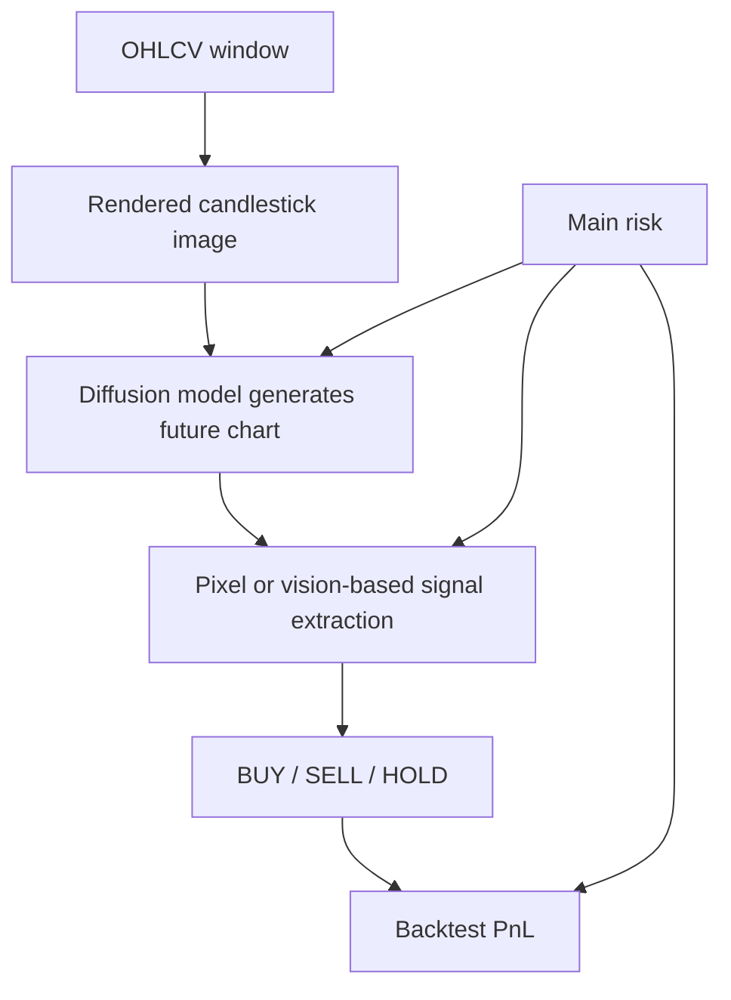
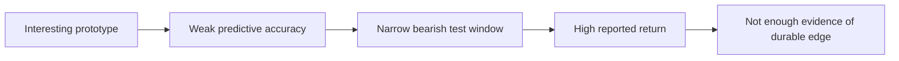

# Model Viability Report

## Verdict

The current model is not viable as a credible trading model yet.

It is an interesting research prototype, but the evidence in this repository is far too weak to support claims of predictive edge, robustness, or deployability. The strongest positive result in the repo, the large backtest return, is more plausibly explained by the evaluation setup and market regime than by a reliable forecasting capability.

## What the model actually is

The project does not train a direct price forecaster. It:

1. Renders 40-candle OHLCV windows into images.
2. Trains InstructPix2Pix / Stable Diffusion 1.5 to generate a chart with 4 future candles appended.
3. Converts the generated image back into a trading action by reading green/red candle pixels or by asking a vision model.

That is a highly indirect pipeline:

`time series -> chart image -> diffusion image generation -> pixel heuristic / vision LLM -> BUY/SELL/HOLD`

Every stage can add noise, and none of the stages proves that the model learned a stable financial signal.

## Critical findings

### 1. Predictive performance is plainly poor

The checked-in BTC backtests report:

- 100-sample run: 35.3% accuracy
- 250-sample run: 27.5% accuracy

The ETH zero-shot backtest reports:

- 25.1% accuracy

Those are not strong numbers. They are especially weak because the task is a 3-class classification problem (`BUY`, `SELL`, `HOLD`) generated from fixed thresholds in [data/render_charts.py](/home/user/vibetrader/data/render_charts.py:18) and [data/render_charts.py](/home/user/vibetrader/data/render_charts.py:126). A model that is consistently below or near weak baselines is not viable without much stronger evidence elsewhere.

### 2. The reported profitability is not persuasive evidence of edge

The repo emphasizes the mismatch between low accuracy and high returns. That is not proof of a good model. It is a warning sign that the evaluation may be fragile.

The backtest logic in [bot/backtest.py](/home/user/vibetrader/bot/backtest.py:131) does this:

- `BUY` -> take raw future return
- `SELL` -> take inverse of raw future return
- `HOLD` -> take zero

In the checked-in BTC data, the backtest period is the last 3 months of the CSV, and the CSV ends on `2026-02-28 12:00:00` UTC. The README itself states buy-and-hold was around `-50%` in that test window. ETH is similarly strongly negative. In a sharply bearish regime, a model can look good just by producing many short signals at roughly the right times.

That does not establish durable edge. It establishes that the test period strongly rewards short exposure.

### 3. The evaluation window is too narrow and too favorable to regime-specific luck

The test split is just the last `N` months in [bot/backtest.py](/home/user/vibetrader/bot/backtest.py:48). Default testing uses 3 months. That is not enough.

This creates several problems:

- No bull-market validation
- No sideways-market validation
- No multi-regime walk-forward testing
- No estimate of return stability over time
- No evidence the result survives re-training or re-sampling

A strategy that works only in one bearish slice is not viable.

### 4. The model target is partly synthetic and may reward image imitation rather than forecasting

The target image is not just “future candles.” It also contains a large colored marker square in the bottom-right corner, added in [data/render_charts.py](/home/user/vibetrader/data/render_charts.py:117). That marker is directly derived from future returns using simple thresholds:

- `BUY` if future move > `+2%`
- `SELL` if future move < `-2%`
- else `HOLD`

This is problematic because the model is trained to edit an image into another image that contains an explicit class label artifact. Even if the extractor later ignores that marker, the training objective still encourages reproducing a stylized labeled target image, not clean price forecasting.

### 5. Signal extraction is heuristic and brittle

The default signal extraction in [inference/extract_signal.py](/home/user/vibetrader/inference/extract_signal.py:1) is a color-counting heuristic over the future-candle region. It does not parse candles structurally. It counts red-dominant versus green-dominant pixels and emits a trade if one color exceeds 60%.

That means the “trading model” is partly:

- a diffusion image generator
- a downstream pixel classifier on its output artifacts

This can easily overfit to rendering style, antialiasing, color bleed, denoising artifacts, and shortcut cues. It is not a robust extraction method for a financial signal.

### 6. The prompt inputs add little and may be mostly ornamental

The prompt is just:

`Predict next 4 candles. RSI=<x>, MACD=<y>`

as seen in [data/render_charts.py](/home/user/vibetrader/data/render_charts.py:205) and [bot/backtest.py](/home/user/vibetrader/bot/backtest.py:90).

There is no ablation showing:

- image-only versus image+prompt
- no-indicator versus RSI-only versus MACD-only
- whether the diffusion model uses the prompt meaningfully at all

Without ablations, there is no reason to assume the prompt contributes useful information.

### 7. There are no serious trading metrics

The repo saves:

- accuracy
- buy accuracy
- sell accuracy
- compounded strategy return
- buy-and-hold return

It does not compute:

- max drawdown
- Sharpe ratio
- Sortino ratio
- volatility
- turnover
- exposure
- profit factor
- tail risk
- regime-by-regime breakdown

This omission is substantial. A trading model is not viable because it has one attractive compounded return number in one period.

### 8. No transaction costs, no slippage, no execution model

The backtest ignores:

- taker or maker fees
- spread
- slippage
- borrow/funding assumptions for shorts
- latency
- partial fills

On a 4-hour crypto strategy these frictions may or may not kill the edge, but the repo does not test it. That alone prevents any serious viability claim.

### 9. The sample size is small and the evaluation is sparse

The “250 sample” backtest is not 250 independent market episodes in a rigorous statistical sense. In [bot/backtest.py](/home/user/vibetrader/bot/backtest.py:61), the code subsamples the test range by stepping through it:

`step = max(1, total_possible // max_samples)`

This means the evaluation is a sparse slice of overlapping windows from one short contiguous period. That is weaker than:

- full rolling evaluation
- walk-forward retraining
- multiple non-overlapping test eras
- bootstrap confidence intervals

### 10. Cross-asset “generalization” is overstated

The README claims BTC-trained signals also work on ETH. But ETH in the tested period appears to share the same broad bearish regime, and the evaluation design is otherwise identical.

That is not strong evidence of cross-asset generalization. It may just mean:

- bearish crypto charts look visually similar
- short-biased signals were rewarded in both assets during the same regime

The repo does not test other classes of assets, other timeframes, or materially different regimes.

### 11. There is no comparison against simpler baselines

This is one of the biggest gaps.

The repo does not compare against:

- always short
- always hold
- RSI threshold rules
- MACD crossover
- random policy with matched trade frequency
- direct classifier on OHLCV features
- direct classifier on chart images without diffusion

Without those baselines, there is no basis for claiming the diffusion approach is justified. It may simply be an expensive and unstable way to recover behavior that a trivial regime-following baseline could match or beat.

### 12. The architecture is expensive relative to the claimed signal

The inference stack uses Stable Diffusion InstructPix2Pix with 20 denoising steps in [inference/predict.py](/home/user/vibetrader/inference/predict.py:47). This is computationally heavy for a 4-hour bar trading problem.

For a model with:

- weak classification accuracy
- no robust validation
- no cost modeling
- no baseline comparison

the complexity is hard to justify. A viable model should beat simpler alternatives before resorting to image generation.

## Overall assessment by dimension

### Scientific validity

Weak.

The project demonstrates an unusual generative setup, but not a convincing forecasting result.

### Trading viability

Weak to non-viable.

The current evidence is insufficient to trade capital, even paper capital with confidence in the signal quality.

### Engineering viability

Moderate as a prototype, weak as a product.

The repo is understandable and the pipeline is coherent, but the evaluation standard is not yet serious enough for deployment decisions.

### Novelty

High.

The idea is novel and visually interesting. Novelty is the strongest part of the project. It is not the same as viability.

## What would have to be true for this to become viable

At minimum, the project would need to clear all of these:

1. Beat simple baselines, especially `always short` during the same bearish window and direct non-diffusion classifiers.
2. Hold up across multiple market regimes with walk-forward evaluation.
3. Include realistic fees, spread, and slippage.
4. Report drawdown and risk-adjusted metrics, not just terminal return.
5. Show ablations proving the diffusion component adds value over simpler image or tabular models.
6. Show stability across retrains and random seeds.
7. Remove or justify any target artifacts that leak label structure into the generated image objective.

## Bottom line

This repository contains an interesting speculative experiment, not a viable trading model.

The current backtests are too regime-dependent, too narrow, too under-controlled, and too weakly benchmarked to support confidence. The low predictive accuracy is not a quirky sign of hidden genius; in this context, it is more likely a signal that the system has not learned a robust forecasting function and that the positive return is being flattered by the test design and market regime.

