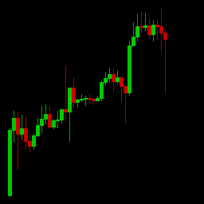
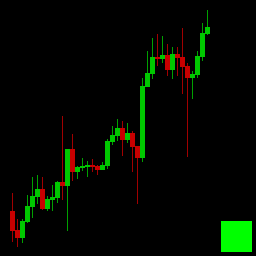
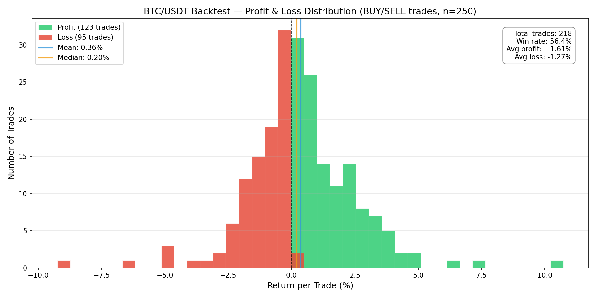

# VibeTrader

**Predicting cryptocurrency price action with diffusion models.**

VibeTrader fine-tunes an [InstructPix2Pix](https://arxiv.org/abs/2211.09800) image-editing diffusion model on rendered candlestick charts to generate future price candles. Instead of predicting a number, it *draws* what the chart will look like next -- and then a signal extractor reads the drawing to produce a BUY, SELL, or HOLD decision.

<p align="center">
  
  &nbsp;&rarr;&nbsp;
  
</p>
<p align="center"><i>Input chart (40 candles) &rarr; Target chart with 4 predicted candles and a BUY marker</i></p>

---

## What makes this novel

Most ML trading systems frame the problem as **time-series regression or classification**: feed numerical OHLCV data into an LSTM / transformer and output a price or label. VibeTrader takes a fundamentally different approach.

### 1. Charts as images, not numbers

Price data is rendered into 256x256 candlestick chart images. The model sees exactly what a human trader would see on a screen -- green and red candles, wicks, patterns -- and learns to visually continue the chart.

### 2. Diffusion models for chart generation

We fine-tune Stable Diffusion 1.5 (via InstructPix2Pix) to perform **conditional image generation**: given an input chart of 40 candles plus a text prompt containing RSI and MACD values, the model generates a new chart with 4 additional future candles and a colored signal marker.

This means the model doesn't just classify -- it *imagines* a plausible visual future for the chart.

### 3. Dual signal extraction

Two methods read the generated image to produce a trading decision:

- **Pixel analysis** -- counts green vs. red pixels in the predicted candle region. Fast (<1ms), no API calls required.
- **Mistral Pixtral vision model** -- sends both the input and generated charts to a vision LLM that interprets candlestick patterns and returns a structured JSON signal with natural language reasoning.

### 4. Accuracy is low, but returns are positive

This is the most counterintuitive finding. On BTC/USDT 4h backtests:

| Metric | Value |
|--------|-------|
| Directional accuracy | 27.5% |
| Strategy return | **+107.97%** |
| Buy & hold return | -50.09% |

The model is wrong more often than a coin flip on direction, yet produces outsized returns. The explanation: when it's right, it tends to be right on **large moves**. When it's wrong, the moves are typically small. This asymmetry produces a positive expected value per trade.

### 5. Cross-asset generalization

The model is trained **only on BTC/USDT**, yet produces profitable signals on ETH/USDT (+95.98% strategy return vs -60.04% buy & hold) without any retraining. It learned general candlestick patterns, not asset-specific behavior.

---

## P&L Distribution

Distribution of returns on all BUY and SELL trades from the BTC/USDT 250-sample backtest:

<p align="center">
  
</p>

| Stat | Value |
|------|-------|
| Total trades (BUY + SELL) | 218 |
| Win rate | 56.4% |
| Average profit (winners) | +1.61% |
| Average loss (losers) | -1.27% |
| Mean return per trade | +0.36% |
| Median return per trade | +0.20% |

The distribution shows a positive skew: winning trades are slightly larger on average than losing trades, and the model wins more often than it loses.

---

## Backtest Results

### BTC/USDT (in-distribution)

| Metric | 100 samples | 250 samples |
|--------|-------------|-------------|
| Accuracy | 35.3% | 27.5% |
| BUY accuracy | 20.5% | 14.4% |
| SELL accuracy | 24.4% | 23.4% |
| Strategy return | +40.84% | +107.97% |
| Buy & hold | -22.57% | -50.09% |

### ETH/USDT (cross-asset, zero-shot)

| Metric | 250 samples |
|--------|-------------|
| Accuracy | 25.1% |
| Strategy return | +95.98% |
| Buy & hold | -60.04% |

---

## How it works

```
OHLCV data                    Rendered charts               Diffusion model
(BTC/USDT 4h)                 (256x256 PNG)                (InstructPix2Pix)

 timestamp,open,...   ──>   ┌──────────────┐    ──>    ┌──────────────┐
 2024-01-01,42000...        │ ██ ▌█        │           │ ██ ▌█  █▌█   │
 2024-01-01,42100...        │█▌ █▌ ██      │           │█▌ █▌ ██ █ █  │
 ...                        │              │           │          ■   │
                            └──────────────┘           └──────────────┘
                             40 input candles           + 4 predicted candles
                                                        + signal marker
                                                            │
                                                            ▼
                                                    Signal extraction
                                                   (pixel or Mistral)
                                                            │
                                                            ▼
                                                   BUY / SELL / HOLD
```

### Pipeline steps

1. **Fetch data** -- Download OHLCV candles from Binance via CCXT, compute RSI and MACD indicators.
2. **Render charts** -- Convert sliding windows of 40 candles into 256x256 images. Create input/target pairs where the target includes 4 future candles and a colored signal marker (green=BUY, red=SELL, gray=HOLD).
3. **Build dataset** -- Assemble image pairs into HuggingFace Dataset format with text prompts.
4. **Train** -- Fine-tune InstructPix2Pix (SD 1.5 UNet) on the chart pairs for 2000 steps.
5. **Predict** -- Given a new chart image and prompt, run 20-step diffusion inference to generate a chart with predicted future candles.
6. **Extract signal** -- Analyze the generated image to determine BUY/SELL/HOLD.
7. **Backtest** -- Evaluate on held-out data: go long on BUY, short on SELL, flat on HOLD.

---

## Project structure

```
vibetrader/
├── data/
│   ├── fetch_ohlcv.py          # Download candles from Binance
│   ├── render_charts.py        # Render OHLCV to chart images
│   └── build_dataset.py        # Build HuggingFace dataset
├── train/
│   ├── run_training.sh         # Training script (Apple Silicon)
│   └── run_training_gpu.sh     # Training script (NVIDIA GPU)
├── inference/
│   ├── predict.py              # Diffusion inference pipeline
│   ├── extract_signal.py       # Pixel-based signal extraction
│   └── extract_signal_mistral.py  # Mistral Pixtral signal extraction
├── bot/
│   ├── backtest.py             # Historical backtesting
│   └── trader.py               # Live paper trading loop
├── app.py                      # Flask backend
├── frontend-v3/                # Interactive prediction UI
├── checkpoints/                # Fine-tuned model weights
├── outputs/                    # Backtest results and comparisons
└── pnl_distribution.png        # P&L distribution chart
```

---

## Quickstart

### Prerequisites

- Python 3.10+
- ~4 GB disk space for model weights
- Apple Silicon (MPS) or NVIDIA GPU recommended; CPU works but is slow

### Install

```bash
python -m venv venv
source venv/bin/activate
pip install -r requirements.txt
```

### Fetch data

```bash
python data/fetch_ohlcv.py --symbol BTC/USDT --timeframe 4h --days 730
```

### Render training charts

```bash
python data/render_charts.py --csv data/btc_usdt_4h.csv --output data/rendered
python data/build_dataset.py --rendered data/rendered --output data/dataset
```

### Train

```bash
# Apple Silicon
bash train/run_training.sh

# NVIDIA GPU
bash train/run_training_gpu.sh
```

### Run backtest

```bash
python -m bot.backtest --csv data/btc_usdt_4h.csv --checkpoint checkpoints/ --output outputs/backtest --max-samples 250
```

### Launch web UI

```bash
python app.py
# Open http://localhost:8923
```

---

## Limitations

- **Two assets tested** -- BTC/USDT and ETH/USDT on 4h timeframe only.
- **Single market regime** -- Backtested on a 3-month bearish window. Bull and sideways markets are not validated.
- **No transaction costs** -- Real trading involves fees, slippage, and spread that would reduce returns.
- **No risk metrics** -- Max drawdown, Sharpe ratio, and volatility are not yet computed.
- **Return asymmetry may not persist** -- Profitability depends on being correct on large moves, which is regime-dependent.

---

## License

Research project. Not financial advice. Use at your own risk.
